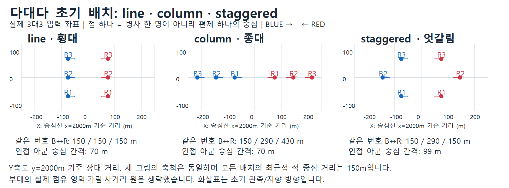

# 다대다 배치와 설계 의도 검증

판정 대상은 현실 전투 예측력이 아니라 **저장된 결과가 현재 코드의 규칙으로 설명되는가**이다. 기존 828회 결과를 분석했으며 엔진은 수정하지 않았다. 기록된 소스 해시가 현재 파일과 일치함을 확인했다. 데이터는 design_findings.json, 분석 코드는 analyze_design.py에 있다.

## 1. 실제 초기 배치



점 하나는 편제 하나의 중심이다. INF_PLT이면 소대, INF_BN이면 대대, INF_IND이면 개인이다. 선은 사격 연결 관계가 아니며 번호가 같은 상대만 공격하도록 지정하지도 않는다. 모든 부대의 초기 위치만 보여 준다.

`tests/upate/experiment.py::deployment`는 BLUE/RED를 x=2000m 기준으로 반사 배치한다.

```python
depth = i*70 if layout == 'column' else (i%2)*70 if layout == 'staggered' else 0
lateral = 0 if layout == 'column' else (i-(n-1)/2)*70
x = 2000 + sign*(75+depth)
y = 2000 + lateral
```

| 배치 | 위치 변화 | 3대3 같은 번호 적까지 거리 | 인접 아군 중심 거리 |
|---|---|---|---|
| line 횡대 | 깊이 없이 좌우로 전개 | 150/150/150m | 70m |
| column 종대 | 한 축에서 뒤로 70m씩 배치 | 150/290/430m | 70m |
| staggered 엇갈림 | 좌우 70m씩, 깊이는 0/70m 반복 | 150/290/150m | 약 99m |

같은 번호 간 거리는 설명용이다. 종대 마지막 부대도 더 가까운 적 선두를 공격할 수 있다. 4대2에서는 각 진영의 자기 인원수로 lateral을 중앙 정렬하므로, 단순히 3대3 그림에 한 점을 추가·삭제한 배치와는 다르다.

이 옵션은 **여러 Unit 중심의 초기 배치**다. 내부 대형, 장비 배치, 교전 교리 또는 전방 참여 인원 제한을 직접 바꾸는 옵션이 아니다. `column`이면 한 명만 사격하거나 앞 부대가 뒤 부대의 탄환을 막도록 한 규칙은 없다. `terrain.py::direct_fire_modifier`는 지형 기반 사격선 검사이며 아군 부대 몸체를 가림 물체로 넣는 검사가 아니다.

좌표 차이는 관측 거리·방향·공유 정보, 표적 선택과 사격 거리, 지역 교전 그룹 및 간접화기의 피해 위치를 통해 작용한다. 따라서 어느 배치가 항상 우세하다는 순위를 코드가 강제하지 않는다.

## 2. 핵심 구현 계약: 결과 이벤트로 확인

| 계약 | 확인 범위 | 판정 |
|---|---|---|
| 생존 사수 수에 따른 개인화기 참여량 | INF_PLT 동종 27회에서 소총 23,637발의 FIRE와 앞선 ELEMENT_LOSS.remaining 대조 | 불일치 0 |
| 생존 포반·가동 포 수에 따른 발사량 | ARTY_PLT 포함 실행의 발사 932건을 손실·장비 상태 변경 순서로 복원 | 불일치 0 |
| 교전 발생 | 828회 | 양측 사격 827회, 한쪽만 사격 1회, 양측 모두 무사격 0회 |
| 관측·준비 지연 | 실행별 첫 사격 시각 | 직사 3.5~10초, 간접 32~56.25초 |
| 더 큰 병력의 잔존 전력 우세 경향 | 동종 4:2/2:4의 432회 | 다수 측 우세 430회, 동률 1회, 소수 측 우세 1회 |

소총 검증은 `rifle_1/2/3`의 small arms에 한정한다. 해당 요소의 생존자가 8에서 1까지 줄었을 때 실제 FIRE.firing_participants가 현재 인원과 일치했다. 따라서 전체 FIRE 건수만 본 검사보다 인원-화력 연결에 대한 직접적인 증거다. 다른 병종의 모든 무기까지 같은 방식으로 복원했다고 주장하지 않는다.

포병 검증은 포병 소대의 포반 25명·포 5문, 무제한 탄약·CONCENTRATED 1문당 1발 설정이다. 장비의 OPERATIONAL/MOBILITY_KILL만 가동으로 계산하고 아래 기대값과 발사량을 비교했다.

```python
expected_rounds = min(fire_capable_guns, surviving_gun_crew // 5)
```

실제 `ARTY_PLT__INF_PLT__3v3__line`, seed 7의 BLUE-1 사례:

| 시각 | 생존 포반 | 가동 장비 | 발사량 |
|---|---:|---:|---:|
| 39.25초 | 15명 | 5문 | 3발 |
| 93.75초 | 9명 | 5문 | 1발 |
| 150.75초 | 5명 | 5문 | 1발 |

포가 그대로 남아 있어도 인원 손실로 실제 발사량이 감소했다. 첫 간접사격이 직사보다 늦은 것도 FireControl의 보고·사격 지휘·포 준비 지연과 부합한다. 다만 저장된 native 이벤트에는 모든 임무 요청·거절 및 당시 트랙 전체가 없으므로, 828회 모든 임무의 승인 사유까지 역검증한 것은 아니다.

별도 통제 결과도 보조 근거다. 생존자 1/2/4명에서 RPM·명시적 주기 경로 모두 60초간 10/20/40발이며, 제2법칙 통제에서 초기 40/20은 40초 후 이론 35.028/5.191, 관측 35/5였다. 이는 단순 조건의 인원 비례 사격을 확인한 것이지 native 생존 비율에 그 식을 강제하는 검사가 아니다.

## 3. 배치 차이가 결과에서 나타나는가

아래는 INF_PLT 3대3, 초기 각 96명, 120초, seed 7/19/41 평균이다. 사격은 양측 FIRE 합계이며 기계적 실탄 발사량이 아니라 엔진의 유효 교전 사격 이벤트다.

| 배치 | BLUE 생존 | RED 생존 | 직사 이벤트 |
|---|---:|---:|---:|
| line | 64.67 | 66.67 | 1,224.67 |
| column | 72.00 | 72.67 | 924.00 |
| staggered | 61.33 | 62.33 | 1,275.00 |

종대에서 후방 요소는 상대와 더 멀고 관측·표적 선택 조건도 다르다. 이 예의 사격량 감소와 피해 감소는 그 구조와 정합적이다. **앞 부대가 뒤 부대의 사격을 막았다는 증거는 아니다.** 거리·관측·표적 선택 중 어느 요인이 몇 %를 설명하는지는 요소별 통제 실험을 하지 않았으므로 분리할 수 없다.

또한 전차 소대는 line/column/staggered 직사 이벤트 평균이 201/226.67/196.67이다. 종대가 항상 적게 쏘는 것이 아니다. 포병 소대 3대3은 각 87명 시작에서 BLUE/RED 생존 평균이 line 30.67/24.33, column 19.67/30.67, staggered 29.67/30.33이었다. 무기 종류와 관측·피해 방식이 다른데 동일한 배치 순위를 기대할 근거는 현재 코드에 없다.

## 4. 이상해 보이는 두 사례의 재현

### 4.1 개인 보병 4대2인데 소수 측이 더 생존

`INF_IND__INF_IND__4v2__staggered`, seed 7은 BLUE 1명, RED 2명이 남았다. 동일 시드로 재실행하여 기존 이벤트 종류별 개수를 재현했다. BLUE는 23발 모두 빗나갔고 RED는 18발 중 3발이 명중했다. BLUE 손실은 29.5/59.5/87초에 발생했다.

이는 소수 측 보너스가 있다는 증거가 아니다. 소수 개체·확률 명중·정수 피해 모델에서는 가능한 결과다. 동종 비대칭 432회 중 430회는 종료 시 다수 측의 strength가 더 컸다. 여기서 우세는 종료 시 잔존 strength의 대소이며 공식 승리 판정이 아니다.

동종 3대3 216회는 RED 잔존 strength가 큰 경우 114회, BLUE가 큰 경우 96회, 동률 6회였다. 동률을 강제하는 모델이 아니라는 점과 부합하지만 이것만으로 진영 편향이 없음을 증명할 수는 없다. 진영 교환·실행 순서·난수 스트림 분리 검사가 필요하다.

### 4.2 Bradley RED가 한 발도 못 쏜 사례

`US_M2_BRADLEY_IND__US_M2_BRADLEY_IND__4v2__column`, seed 7을 재실행해 기존 이벤트 종류별 개수를 재현했다.

- RED-1/2는 0.25초에 조준을 시작했다. 무기별 지연은 약 5.3~6.7초였다.
- RED-1은 3.75초에 승무원 3→2명, RED-2는 5초에 3→1명이 됐다.
- 차량당 3명이 필요하므로 첫 사격 준비 완료 전에 두 차량 모두 운용 불가가 됐다.
- 최종 RED는 차량 2대가 남았지만 승무원 0명, 참여량 0이었다.

**운용 인원 제한은 의도대로 작동했다.** 다만 이 편제의 vehicle_crew에는 전차 편제와 달리 protected_by가 없어 동축기관총 등이 승무원을 직접 공격할 수 있었다. “장갑차 차내 승무원도 차량이 보호한다”가 설계 의도라면 이 차이는 별도 정리 대상이다. 단순히 이번 결과를 버그라고 하거나, 완전히 만족스럽다고 단정하기보다는 보호 정책을 먼저 정해야 한다.

## 5. 가장 중요한 테스트 구조상의 한계

### 5.1 편제 크기와 무관한 70m/150m 고정 간격

현재 footprint_for가 반환하는 초기 길이×폭은 다음과 같다.

| 편제 | 길이×폭 |
|---|---|
| INF_PLT | 110×75m |
| INF_COY | 198×135m |
| INF_BN | 341×232.5m |
| ARTY_PLT | 260×170m |
| ARTY_BN | 806×527m |

반면 모든 실험은 인접 아군 중심을 70m 간격으로 놓고 최근접 적 중심 거리를 150m로 설정했다. 횡대 ARTY_BN의 아군 footprint 폭 527m는 중심 간격 70m보다 훨씬 크고, 적과 마주한 길이 806m도 중심 간격 150m보다 크다. 부대 점유 영역들이 초기부터 크게 겹친다.

이는 좌표 생성 실패가 아니다. 입력한 좌표와 footprint를 그대로 쓰는 결과다. 그러나 **병종·제대별 배치 효과를 독립적으로 비교하는 테스트로는 혼입 요인이 크다.** 특히 포탄 효과는 footprint 내부 인원 위치를 표본 추출하므로 겹침의 영향을 받는다. 현실성을 떠나 우리가 어떤 실험을 의도했는지 명확히 해야 한다.

추천: 엔진 화력 보정보다 먼저 배치 생성기를 바꿔 (a) 인접 footprint가 겹치지 않는 간격, (b) 적 전방 경계 사이의 동일 간격, (c) 같은 기준의 사거리·관측 조건을 비교한다. 기존 70/150m 실험은 밀집·근접 스트레스 검사로 보존한다.

### 5.2 살아 있는 장비와 전투 가능 상태는 다르다

828회 중 694회가 TIME_LIMIT였다. 그중 233회는 종료 시 한쪽의 weapon_systems가 0인데도 strength가 남아 있었다. 이는 현재 테스트의 종료 분류가 물리적 잔존 strength를 사용하기 때문이다.

따라서 TIME_LIMIT를 무승부나 “양쪽 모두 계속 싸울 수 있음”으로 읽으면 안 된다. 엔진 규칙 위반보다는 **결과 지표가 의도한 전투 결과를 충분히 표현하는가**의 문제다. 장비 생존, 인원 생존, 현재 화력 사용 불가, 목표 달성·철수 등을 별도 필드로 나누는 것이 좋다.

### 5.3 참여량 합계와 실제 무기 실물 수를 구분

snapshot의 weapon_systems는 각 무기 스트림의 participants 합계다. 동일 차량의 여러 무기·탄종이 각자 스트림으로 등록될 수 있어 실제 차량·사수 수와 같지 않다. 포별 실물 수나 총 전투원 수로 해석하지 않아야 한다. 동일 포신의 탄종 간 동시 사격 제한까지 필요하면 장비 슬롯별 공유 주기 모델을 별도로 설계해야 한다.

## 6. 판단 및 권장 순서

**확인한 범위에서는 핵심 변경이 설계대로 작동한다.** 생존 인원-참여량 연결, 포반·가동 장비 제한, 지연된 포병 사격, 확률 피해에 따른 예외를 실제 저장 이벤트로 설명할 수 있다. 배치별 성적이 완전히 대칭이거나 한 배치가 항상 우세해야 한다는 요구는 현재 설계에 없다.

다음 순서가 적절하다.

1. 현재 결과와 분석을 회귀 기준으로 보존한다.
2. 테스트 배치 간격을 footprint 기준으로 구분하고 결과의 전투 불능/잔존 지표를 보완한다.
3. 전차와 IFV의 승무원 보호 정책을 명시적으로 통일하거나 차이를 문서화한다.
4. 완전 관측·고정 명중률·동일 사거리 조건에서 배치만 바꾸는 통제 실험으로 거리/관측/피해 범위의 영향을 분리한다.
5. 그 뒤 아군의 사격선 차폐, 전방 참여 인원, 부대 내부 배치, 이동 대형 유지, 장비별 공유 발사 주기 등의 추가 구조가 필요한지 판단한다.

현재 전체 native 결과만으로 각 사격의 관측·승인 이유나 모든 사용자 편제까지 검증했다고 말할 수는 없다. 이번 분석은 저장 이벤트와 재현한 두 사례, 기존 통제 검사 및 현재 코드의 범위에 한정한다.

## 재현

```powershell
$env:PYTHONUTF8='1'
$env:PYTHONDONTWRITEBYTECODE='1'
python tests/upate/analysis/analyze_design.py
python tests/upate/analysis/edge_case_probe.py
& tests/upate/analysis/draw_layouts.ps1
```

원시 828회 실험은 다시 실행하지 않았으며, 이상 사례 두 건만 로그 확인을 위해 같은 시드로 재실행했다. 전체 원본 결과와 엔진은 변경하지 않았다.
